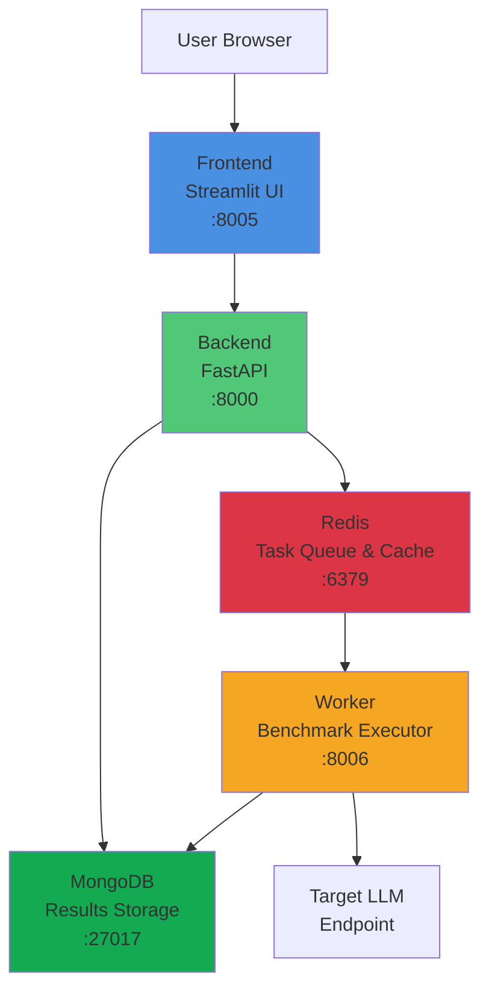

## Architecture Overview

JustBenchThatLLM is a distributed benchmarking platform built on a microservices architecture with five core components working together to provide scalable, reliable LLM endpoint testing.

### High-Level Architecture



## Data Flow

The system follows a queue-based asynchronous processing pattern:

### 1. Benchmark Submission Flow

```
User → Frontend → Backend → Redis Queue → Worker → Target LLM
                     ↓
                  MongoDB (metadata)
```

1. **User Input**: User configures benchmark parameters in Streamlit UI
2. **API Request**: Frontend sends benchmark configuration to Backend REST API
3. **Task Queuing**: Backend validates configuration and enqueues task to Redis
4. **Metadata Storage**: Backend stores benchmark metadata in MongoDB
5. **Task Processing**: Worker pulls task from Redis queue
6. **Benchmark Execution**: Worker generates load and sends requests to target LLM endpoint

### 2. Results Collection Flow

```
Worker → MongoDB ← Backend ← Frontend ← User
```

1. **Metric Collection**: Worker collects latency, throughput, and error metrics
2. **Results Storage**: Worker writes detailed results and metrics to MongoDB
3. **Status Polling**: Frontend polls Backend for benchmark status
4. **Data Retrieval**: Backend queries MongoDB for results
5. **Visualization**: Frontend renders charts and tables for user analysis

### 3. Real-time Monitoring Flow

```
Worker → Redis (cache) → Backend → Frontend
   ↓
MongoDB (persistent)
```

- Worker updates progress in Redis for real-time status
- Backend serves cached status for active benchmarks
- Final results persisted to MongoDB for historical analysis

## Component Interactions

### Frontend ↔ Backend

**Communication**: HTTP/REST API  
**Port**: Backend exposes port 8000  
**Endpoints**:
- `POST /benchmarks` - Submit new benchmark
- `GET /benchmarks/{id}` - Retrieve benchmark status
- `GET /benchmarks/{id}/results` - Fetch detailed results
- `GET /health` - Health check
- `GET /ready` - Readiness check

### Backend ↔ Redis

**Communication**: Redis protocol  
**Port**: 6379  
**Usage**:
- Task queue management (publish/subscribe)
- Active benchmark status caching
- Worker coordination and load distribution

**Configuration**:
```bash
REDIS_URL=redis://redis:6379/0
```

### Backend ↔ MongoDB

**Communication**: MongoDB Wire Protocol  
**Port**: 27017  
**Usage**:
- Benchmark configuration storage
- Results persistence
- Historical data queries
- Comparison data retrieval

**Configuration**:
```bash
MONGODB_URL=mongodb://mongodb:27017
MONGODB_DB_NAME=benchmark_db
STORAGE_TYPE=mongodb
```

### Worker ↔ Redis

**Communication**: Redis protocol  
**Port**: 6379  
**Usage**:
- Task consumption from queue
- Progress updates
- Status reporting

### Worker ↔ MongoDB

**Communication**: MongoDB Wire Protocol  
**Port**: 27017  
**Usage**:
- Write benchmark results
- Store request-level metrics
- Update benchmark status

### Worker ↔ Target LLM Endpoints

**Communication**: HTTP/HTTPS (OpenAI-compatible API)  
**Ports**: Variable (user-configured)  
**Usage**:
- Send inference requests with configured parameters
- Measure latency (TTFT, total response time)
- Track throughput and error rates

## Port Mappings

<CardGroup cols={2}>
  <Card title="Frontend" icon="browser">
    **Port**: 8005  
    **Protocol**: HTTP  
    **Access**: User interface
  </Card>
  
  <Card title="Backend" icon="server">
    **Port**: 8000  
    **Protocol**: HTTP  
    **Access**: REST API
  </Card>
  
  <Card title="Worker" icon="gears">
    **Port**: 8006  
    **Protocol**: HTTP  
    **Access**: Health checks only
  </Card>
  
  <Card title="Redis" icon="database">
    **Port**: 6379  
    **Protocol**: Redis  
    **Access**: Internal only
  </Card>
  
  <Card title="MongoDB" icon="database">
    **Port**: 27017  
    **Protocol**: MongoDB  
    **Access**: Internal only
  </Card>
</CardGroup>

## Deployment Configurations

### Docker Compose Deployment

```yaml
Services:
  - frontend:8005 → backend:8000
  - backend:8000 → redis:6379, mongo:27017
  - worker → redis:6379, mongo:27017
```

**Network**: Single Docker bridge network  
**Service Discovery**: DNS-based (container names)  
**Persistence**: Named volumes for Redis and MongoDB

### Kubernetes Deployment (Helm)

```yaml
Services:
  - frontend (ClusterIP:8005)
  - backend (ClusterIP:8000)
  - worker (Deployment, no service)
  - redis (StatefulSet, ClusterIP:6379)
  - mongo (StatefulSet, ClusterIP:27017)
```

**Network**: Kubernetes service mesh  
**Service Discovery**: Kubernetes DNS  
**Persistence**: PersistentVolumeClaims with configurable storage classes  
**Ingress**: Optional for Frontend (disabled by default)

## Scalability Considerations

### Horizontal Scaling

- **Backend**: Can run multiple replicas behind load balancer
- **Worker**: Can scale to multiple instances for parallel benchmark execution
- **Frontend**: Stateless, can run multiple replicas
- **Redis**: Single instance (can be configured for Redis Cluster)
- **MongoDB**: Single instance (can be configured for replica set)

### Resource Allocation

<Tabs>
  <Tab title="Docker Compose">
    Resources managed by Docker daemon  
    No explicit limits by default  
    Configure via `deploy.resources` in docker-compose.yml
  </Tab>
  
  <Tab title="Kubernetes">
    **Frontend**: 128Mi-256Mi RAM, 50m-200m CPU  
    **Backend**: 256Mi-512Mi RAM, 100m-500m CPU  
    **Worker**: 512Mi-1Gi RAM, 250m-1000m CPU  
    **Redis**: 256Mi-512Mi RAM, 100m-500m CPU  
    **MongoDB**: 512Mi-2Gi RAM, 250m-1000m CPU
  </Tab>
</Tabs>

## High Availability

### Health Checks

All components implement health check endpoints:

- **Backend**: `GET /health` and `GET /ready`
- **Worker**: `GET /health` and `GET /ready` (port 8006)
- **Redis**: `redis-cli ping`
- **MongoDB**: `mongosh --eval "db.adminCommand('ping')"`

### Restart Policies

- **Docker Compose**: `restart: unless-stopped` on all services
- **Kubernetes**: Automatic pod restarts with configurable liveness/readiness probes

### Data Persistence

- **Redis**: AOF (Append-Only File) persistence enabled
- **MongoDB**: Data persisted to `/data/db` volume
- **Docker**: Named volumes (`redis_data`, `mongo_data`)
- **Kubernetes**: PersistentVolumeClaims (8Gi for Redis, 20Gi for MongoDB)

## Security Considerations

### Network Isolation

- Redis and MongoDB are internal-only services
- No external access to data stores
- Frontend is the only user-facing component

### Service Communication

- All inter-service communication within private network
- Backend validates all API requests
- Worker authenticates with target LLM endpoints using user-provided credentials

### TLS/SSL Support

- Worker supports custom CA bundles for HTTPS endpoints
- Configurable via `caBundle` settings in Helm values
- Backend can be configured with custom certificates

<Info>
  For production deployments, configure ingress with TLS termination and consider implementing authentication for the Frontend.
</Info>

## Related Resources

<CardGroup cols={2}>
  <Card title="Component Details" icon="cube" href="/reference/components">
    Deep dive into each component's functionality and configuration
  </Card>
  
  <Card title="Docker Deployment" icon="docker" href="/getting-started/docker">
    Deploy with Docker Compose
  </Card>
  
  <Card title="Kubernetes Deployment" icon="dharmachakra" href="/getting-started/kubernetes">
    Deploy with Helm charts
  </Card>
  
  <Card title="Configuration" icon="sliders" href="/configuration/overview">
    Configure components and settings
  </Card>
</CardGroup>