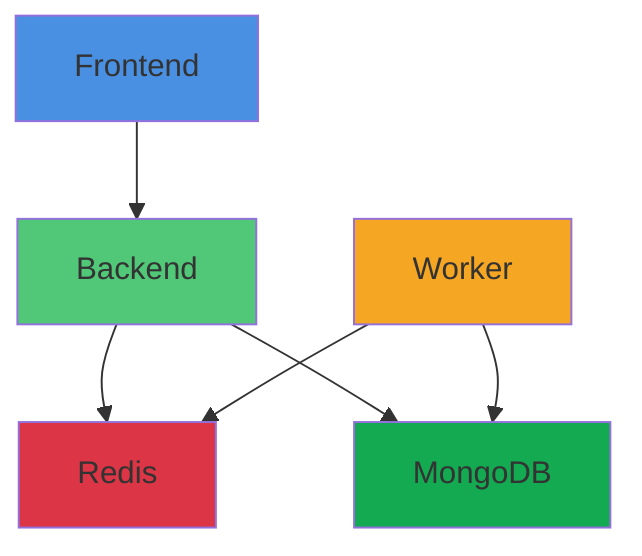

## Component Overview

JustBenchThatLLM consists of five specialized components, each serving a distinct role in the benchmarking pipeline.

<CardGroup cols={2}>
  <Card title="Frontend" icon="browser" color="#4A90E2">
    **Web UI**  
    User interface for benchmark configuration and results visualization
  </Card>
  
  <Card title="Backend" icon="server" color="#50C878">
    **FastAPI REST API**  
    Orchestrates benchmarks and manages data persistence
  </Card>
  
  <Card title="Worker" icon="gears" color="#F5A623">
    **Benchmark Executor**  
    Generates load and executes benchmarks against target endpoints
  </Card>
  
  <Card title="Redis" icon="database" color="#DC3545">
    **Task Queue & Cache**  
    Message broker and real-time status cache
  </Card>
  
  <Card title="MongoDB" icon="database" color="#13AA52">
    **Results Storage**  
    Persistent storage for configurations and metrics
  </Card>
</CardGroup>

## Frontend

### Overview

The Frontend is a web application providing an intuitive interface for:
- Configuring benchmark parameters
- Managing target LLM endpoints
- Monitoring active benchmarks
- Visualizing results with interactive charts
- Comparing benchmark runs

### Technical Specifications

**Docker Image**: `redteamsfr/benchmark-frontend:latest`  
**Port**: 8005  
**Language**: Python

### Configuration

#### Environment Variables

<ParamField path="BACKEND_BASE_URL" type="string" required>
  URL of the Backend API service
  
  **Docker Compose**: `http://backend:8000`  
  **Kubernetes**: Auto-configured to backend service URL  
  **External**: `http://your-backend-host:8000`
</ParamField>

<ParamField path="APP_PASSWORD" type="string">
  Optional authentication password for UI access (Kubernetes only)
  
  <Warning>
    Set a strong password before deploying to production Kubernetes clusters
  </Warning>
</ParamField>

### Deployment Configuration

<Tabs>
  <Tab title="Docker Compose">
    ```yaml
    frontend:
      image: redteamsfr/benchmark-frontend:latest
      container_name: benchmark-frontend
      ports:
        - "8005:8005"
      environment:
        - BACKEND_BASE_URL=http://backend:8000
      restart: unless-stopped
    ```
  </Tab>
  
  <Tab title="Kubernetes (Helm)">
    ```yaml
    frontend:
      enabled: true
      image:
        repository: redteamsfr/benchmark-frontend
        tag: latest
        pullPolicy: IfNotPresent
      service:
        type: ClusterIP
        port: 8005
      replicaCount: 1
      resources:
        requests:
          memory: "128Mi"
          cpu: "50m"
        limits:
          memory: "256Mi"
          cpu: "200m"
    ```
  </Tab>
</Tabs>

### Features

- **Dashboard**: Overview of recent benchmarks with filtering by tags and dates
- **Endpoint Management**: Add, test, and manage target LLM endpoints
- **Workload Configuration**: Design custom load patterns (fixed or stepped)
- **Live Monitoring**: Real-time progress tracking during benchmark execution
- **Results Analysis**: Interactive charts for latency, throughput, and TTFT metrics
- **Comparison Tools**: Side-by-side radar charts and overlay graphs
- **Export**: Download results as CSV or JSON
- **Dark Mode**: Eye-friendly theme support

### Health Checks

**Endpoint**: `GET /`  
**Initial Delay**: 30 seconds  
**Period**: 10 seconds  
**Timeout**: 5 seconds

---

## Backend

### Overview

The Backend is a FastAPI-based REST API that:
- Receives benchmark requests from Frontend
- Validates configurations
- Enqueues tasks to Redis
- Manages MongoDB persistence
- Serves results and status updates

### Technical Specifications

**Docker Image**: `redteamsfr/benchmark-backend:latest`  
**Port**: 8000  
**Framework**: FastAPI  
**Language**: Python

### API Endpoints

<AccordionGroup>
  <Accordion title="POST /benchmarks" icon="play">
    Submit a new benchmark for execution
    
    **Request Body**:
    ```json
    {
      "endpoint_url": "https://api.example.com/v1/chat/completions",
      "model": "gpt-3.5-turbo",
      "prompt": "Write a story about...",
      "load_type": "fixed",
      "concurrency": 10,
      "total_requests": 100,
      "tags": ["production", "test"]
    }
    ```
    
    **Response**:
    ```json
    {
      "benchmark_id": "uuid-here",
      "status": "queued"
    }
    ```
  </Accordion>
  
  <Accordion title="GET /benchmarks/{id}" icon="info">
    Retrieve benchmark status and metadata
    
    **Response**:
    ```json
    {
      "id": "uuid-here",
      "status": "running",
      "progress": 45,
      "started_at": "2026-03-01T10:00:00Z",
      "config": {...}
    }
    ```
  </Accordion>
  
  <Accordion title="GET /benchmarks/{id}/results" icon="chart-line">
    Fetch detailed benchmark results
    
    **Response**:
    ```json
    {
      "metrics": {
        "latency_p50": 245.3,
        "latency_p95": 890.1,
        "throughput": 42.5,
        "success_rate": 99.8
      },
      "requests": [...]
    }
    ```
  </Accordion>
  
  <Accordion title="GET /health" icon="heart-pulse">
    Health check endpoint
    
    **Response**: `{"status": "healthy"}`
  </Accordion>
  
  <Accordion title="GET /ready" icon="circle-check">
    Readiness check endpoint (verifies Redis and MongoDB connectivity)
    
    **Response**: `{"status": "ready"}`
  </Accordion>
</AccordionGroup>

### Configuration

#### Environment Variables

<ParamField path="REDIS_URL" type="string" required>
  Redis connection URL
  
  **Default**: `redis://redis:6379/0`
</ParamField>

<ParamField path="MONGODB_URL" type="string" required>
  MongoDB connection URL
  
  **Default**: `mongodb://mongodb:27017`
</ParamField>

<ParamField path="MONGODB_DB_NAME" type="string" required>
  MongoDB database name
  
  **Default**: `benchmark_db`
</ParamField>

<ParamField path="STORAGE_TYPE" type="string" required>
  Storage backend type
  
  **Default**: `mongodb`  
  **Options**: `mongodb` (only supported option currently)
</ParamField>

<ParamField path="LOG_LEVEL" type="string">
  Logging verbosity level
  
  **Default**: `INFO`  
  **Options**: `DEBUG`, `INFO`, `WARNING`, `ERROR`, `CRITICAL`
</ParamField>

### Deployment Configuration

<Tabs>
  <Tab title="Docker Compose">
    ```yaml
    backend:
      image: redteamsfr/benchmark-backend:latest
      container_name: benchmark-backend
      ports:
        - "8000:8000"
      environment:
        - REDIS_URL=redis://redis:6379/0
        - LOG_LEVEL=INFO
        - STORAGE_TYPE=mongodb
        - MONGODB_URL=mongodb://mongodb:27017
        - MONGODB_DB_NAME=benchmark_db
      depends_on:
        redis:
          condition: service_healthy
        mongo:
          condition: service_healthy
        worker:
          condition: service_started
      restart: unless-stopped
    ```
  </Tab>
  
  <Tab title="Kubernetes (Helm)">
    ```yaml
    backend:
      enabled: true
      image:
        repository: redteamsfr/benchmark-backend
        tag: latest
      service:
        type: ClusterIP
        port: 8000
      replicaCount: 1
      env:
        LOG_LEVEL: INFO
        STORAGE_TYPE: mongodb
        MONGODB_DB_NAME: benchmark_db
      resources:
        requests:
          memory: "256Mi"
          cpu: "100m"
        limits:
          memory: "512Mi"
          cpu: "500m"
    ```
  </Tab>
</Tabs>

### Health Checks

**Liveness**: `GET /health` (30s delay, 10s period)  
**Readiness**: `GET /ready` (10s delay, 5s period)

### TLS/SSL Configuration

For connecting to MongoDB or Redis with custom certificates:

```yaml
caBundle:
  enabled: true
  content: |
    -----BEGIN CERTIFICATE-----
    ...
    -----END CERTIFICATE-----
  mountPath: /etc/ssl/certs/ca-bundle.pem
```

---

## Worker

### Overview

The Worker is the benchmark execution engine that:
- Pulls tasks from Redis queue
- Generates HTTP load to target LLM endpoints
- Measures latency, throughput, and TTFT
- Collects detailed request-level metrics
- Writes results to MongoDB

### Technical Specifications

**Docker Image**: `redteamsfr/benchmark-worker:latest`  
**Port**: 8006 (health checks only)  
**Language**: Python

### Benchmark Capabilities

#### Load Generation Modes

<CardGroup cols={2}>
  <Card title="Fixed Load" icon="equals">
    Constant concurrency level throughout the benchmark
    
    **Use Case**: Baseline performance, steady-state testing
  </Card>
  
  <Card title="Stepped Load" icon="stairs">
    Gradually increasing concurrency to find breaking points
    
    **Use Case**: Capacity planning, stress testing
  </Card>
</CardGroup>

#### Metrics Collected

- **Latency Distribution**: Min, P50, P90, P95, P99, Max
- **TTFT (Time To First Token)**: Critical for streaming responses
- **Throughput**: Requests per second, Tokens per second
- **Success Rate**: Percentage of successful requests
- **Error Rate**: Failed requests with error categorization
- **Request Timeline**: Individual request details for analysis

### Configuration

#### Environment Variables

<ParamField path="REDIS_URL" type="string" required>
  Redis connection URL for task queue
  
  **Default**: `redis://redis:6379/0`
</ParamField>

<ParamField path="MONGODB_URL" type="string" required>
  MongoDB connection URL for results storage
  
  **Default**: `mongodb://mongodb:27017`
</ParamField>

<ParamField path="MONGODB_DB_NAME" type="string" required>
  MongoDB database name
  
  **Default**: `benchmark_db`
</ParamField>

<ParamField path="STORAGE_TYPE" type="string" required>
  Storage backend type
  
  **Default**: `mongodb`
</ParamField>

<ParamField path="LOG_LEVEL" type="string">
  Logging verbosity level
  
  **Default**: `INFO`
</ParamField>

### Deployment Configuration

<Tabs>
  <Tab title="Docker Compose">
    ```yaml
    worker:
      image: redteamsfr/benchmark-worker:latest
      container_name: benchmark-worker
      environment:
        - REDIS_URL=redis://redis:6379/0
        - LOG_LEVEL=INFO
        - MONGODB_URL=mongodb://mongodb:27017
        - MONGODB_DB_NAME=benchmark_db
        - STORAGE_TYPE=mongodb
      depends_on:
        redis:
          condition: service_healthy
        mongo:
          condition: service_healthy
      restart: unless-stopped
    ```
  </Tab>
  
  <Tab title="Kubernetes (Helm)">
    ```yaml
    worker:
      enabled: true
      image:
        repository: redteamsfr/benchmark-worker
        tag: latest
      replicaCount: 1
      env:
        LOG_LEVEL: INFO
        STORAGE_TYPE: mongodb
        MONGODB_DB_NAME: benchmark_db
      resources:
        requests:
          memory: "512Mi"
          cpu: "250m"
        limits:
          memory: "1Gi"
          cpu: "1000m"
    ```
  </Tab>
</Tabs>

### Scaling Workers

Workers can be horizontally scaled for parallel benchmark execution:

```bash
# Docker Compose
docker-compose up -d --scale worker=3

# Kubernetes
kubectl scale deployment worker --replicas=3
```

### Health Checks

**Liveness**: `GET /health` on port 8006 (30s delay, 10s period)  
**Readiness**: `GET /ready` on port 8006 (10s delay, 5s period)

### TLS/SSL for Target Endpoints

Worker includes default CA bundle for HTTPS endpoints. Configure custom certificates:

```yaml
caBundle:
  enabled: true
  content: |
    -----BEGIN CERTIFICATE-----
    MIIDxTCCAq2gAwIBAgIQAqxcJmoLQ...
    -----END CERTIFICATE-----
  mountPath: /etc/ssl/certs/ca-bundle.pem
```

---

## Redis

### Overview

Redis serves as the message broker and cache:
- **Task Queue**: Benchmark tasks awaiting execution
- **Status Cache**: Real-time benchmark progress
- **Worker Coordination**: Load distribution across workers

### Technical Specifications

**Docker Image**: `redis:7-alpine`  
**Port**: 6379  
**Persistence**: AOF (Append-Only File)

### Configuration

<Tabs>
  <Tab title="Docker Compose">
    ```yaml
    redis:
      image: redis:7-alpine
      container_name: redis
      ports:
        - "6379:6379"
      volumes:
        - redis_data:/data
      command: ["redis-server", "--appendonly", "yes"]
      restart: unless-stopped
      healthcheck:
        test: ["CMD", "redis-cli", "ping"]
        interval: 5s
        timeout: 3s
        retries: 5
    ```
  </Tab>
  
  <Tab title="Kubernetes (Helm)">
    ```yaml
    redis:
      enabled: true
      image:
        repository: redis
        tag: 7-alpine
      service:
        type: ClusterIP
        port: 6379
      replicaCount: 1
      persistence:
        enabled: true
        size: 8Gi
        accessMode: ReadWriteOnce
      resources:
        requests:
          memory: "256Mi"
          cpu: "100m"
        limits:
          memory: "512Mi"
          cpu: "500m"
      command: ["redis-server"]
      args: ["--appendonly", "yes"]
    ```
  </Tab>
</Tabs>

### Persistence

- **Mode**: Append-Only File (AOF)
- **Benefit**: Durability for task queue, prevents task loss on restart
- **Storage**: 
  - Docker: Named volume `redis_data`
  - Kubernetes: PersistentVolumeClaim (8Gi default)

### Health Checks

**Command**: `redis-cli ping`  
**Interval**: 5 seconds  
**Timeout**: 3 seconds  
**Retries**: 5

<Info>
  Redis is configured for single-instance deployment. For high availability, consider Redis Sentinel or Redis Cluster.
</Info>

---

## MongoDB

### Overview

MongoDB provides persistent storage for:
- **Benchmark Configurations**: Parameters, endpoints, workload definitions
- **Results**: Aggregated metrics and statistics
- **Request Data**: Detailed request-level telemetry
- **Historical Data**: Past benchmarks for comparison

### Technical Specifications

**Docker Image**: `mongo:8.0`  
**Port**: 27017  
**Database**: `benchmark_db` (configurable)

### Configuration

<Tabs>
  <Tab title="Docker Compose">
    ```yaml
    mongo:
      image: mongo:8.0
      container_name: mongodb
      ports:
        - "27017:27017"
      volumes:
        - mongo_data:/data/db
      restart: unless-stopped
      healthcheck:
        test: ["CMD", "mongosh", "--eval", "db.adminCommand('ping')"]
        interval: 5s
        timeout: 3s
        retries: 5
    ```
  </Tab>
  
  <Tab title="Kubernetes (Helm)">
    ```yaml
    mongo:
      enabled: true
      image:
        repository: mongo
        tag: 8.0
      service:
        type: ClusterIP
        port: 27017
      replicaCount: 1
      persistence:
        enabled: true
        size: 20Gi
        accessMode: ReadWriteOnce
      resources:
        requests:
          memory: "512Mi"
          cpu: "250m"
        limits:
          memory: "2Gi"
          cpu: "1000m"
    ```
  </Tab>
</Tabs>

### Data Schema

#### Benchmarks Collection

```javascript
{
  _id: ObjectId,
  benchmark_id: "uuid",
  status: "queued|running|completed|failed",
  config: {
    endpoint_url: String,
    model: String,
    concurrency: Number,
    total_requests: Number,
    // ... other config
  },
  created_at: ISODate,
  started_at: ISODate,
  completed_at: ISODate,
  tags: [String]
}
```

#### Results Collection

```javascript
{
  _id: ObjectId,
  benchmark_id: "uuid",
  metrics: {
    latency_min: Number,
    latency_p50: Number,
    latency_p95: Number,
    latency_p99: Number,
    latency_max: Number,
    ttft_p50: Number,
    throughput_rps: Number,
    throughput_tps: Number,
    success_rate: Number
  },
  requests: [
    {
      request_id: String,
      latency: Number,
      ttft: Number,
      status: Number,
      timestamp: ISODate
    }
  ]
}
```

### Persistence

- **Storage**: 
  - Docker: Named volume `mongo_data` mounted at `/data/db`
  - Kubernetes: PersistentVolumeClaim (20Gi default)
- **Backup**: Standard MongoDB backup tools compatible

### Health Checks

**Command**: `mongosh --eval "db.adminCommand('ping')"`  
**Interval**: 5 seconds  
**Timeout**: 3 seconds  
**Retries**: 5

<Warning>
  MongoDB is deployed without authentication by default. For production, enable authentication and configure credentials.
</Warning>

---

## Component Dependencies



### Startup Order

1. **Redis** - Must be healthy before backend/worker start
2. **MongoDB** - Must be healthy before backend/worker start
3. **Worker** - Can start once Redis and MongoDB are healthy
4. **Backend** - Waits for Redis, MongoDB, and Worker
5. **Frontend** - Can start anytime (will retry backend connection)

## Docker Images

All images are hosted on Docker Hub under the `redteamsfr` organization:

<CardGroup cols={3}>
  <Card title="Frontend">
    `redteamsfr/benchmark-frontend:latest`
  </Card>
  
  <Card title="Backend">
    `redteamsfr/benchmark-backend:latest`
  </Card>
  
  <Card title="Worker">
    `redteamsfr/benchmark-worker:latest`
  </Card>
</CardGroup>

### Version Tags

- `latest` - Most recent stable release
- `vX.Y.Z` - Specific version tags (when available)
- `edge` - Latest development build (if available)

<Tip>
  For production deployments, use specific version tags instead of `latest` to ensure consistency across environments.
</Tip>

## Related Resources

<CardGroup cols={2}>
  <Card title="System Architecture" icon="diagram-project" href="/reference/architecture">
    Overall architecture and data flow
  </Card>
  
  <Card title="Configuration Guide" icon="sliders" href="/configuration/overview">
    Detailed configuration options
  </Card>
  
  <Card title="Docker Setup" icon="docker" href="/getting-started/docker">
    Deploy with Docker Compose
  </Card>
  
  <Card title="Kubernetes Setup" icon="dharmachakra" href="/getting-started/kubernetes">
    Deploy with Helm charts
  </Card>
</CardGroup>